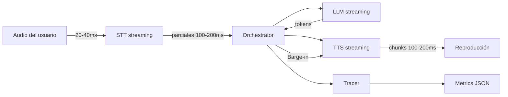

# 🧠 Sanctuary – Voice Streaming Pipeline

Sanctuary ahora expone una **pipeline de voz casi en tiempo real** con escucha, razonamiento y respuesta en modo *full duplex controlado*. El sistema recibe audio continuo, publica parciales de STT, genera tokens de LLM en streaming y sintetiza voz con soporte de *barge-in* y telemetría de latencias.

---

## 🔁 Flujo de extremo a extremo



1. **LISTENING** – El usuario envía audio PCM por WebSocket `/voice`.
2. **THINKING** – Cuando el VAD detecta silencio o un posible final de frase, el orquestador construye el prompt y activa `LLM.generate_stream()`.
3. **SPEAKING** – El primer token activa TTS inmediatamente; los chunks de audio se envían al cliente con un *jitter buffer* de ~150 ms.
4. **Barge-in** – Si el usuario vuelve a hablar, el orquestador detiene TTS (`stop()` + *fade*) y retoma la escucha.
5. **Tracing** – Cada turno registra `stt_first_partial_ms`, `stt_final_ms`, `llm_first_token_ms`, `tts_first_audio_ms` y `turn_total_ms`.

Objetivo de latencias: primeras palabras del asistente en < 800 ms, turno completo < 1.2 s.

---

## 🚀 Cómo ejecutar el servidor `/voice`

1. **Instala dependencias** (recomendado usar entorno virtual):

   ```bash
   python -m venv .venv
   source .venv/bin/activate
   pip install -r requirements.txt
   pip install fastapi uvicorn pytest  # utilidades del servidor y pruebas
   ```

2. **Inicia el servidor WebSocket**:

   ```bash
   uvicorn main:app --reload --host 0.0.0.0 --port 8000
   ```

3. **Conéctate al endpoint** `ws://localhost:8000/voice` enviando audio PCM mono 16 kHz (20–40 ms por chunk). El servidor responde con:

   ```json
   {"type": "stt_partial", "text": "hola es", "is_final": false}
   {"type": "stt_final", "text": "hola, ¿estás ahí?", "is_final": true}
   {"type": "assistant_text", "text": "¡Hola! Sí, te escucho."}
   {"type": "metrics", "stt_first_partial_ms": 180, "llm_first_token_ms": 220, "tts_first_audio_ms": 140, "turn_total_ms": 980}
   ```

   El audio de salida se envía como frames binarios PCM listos para reproducción.

> **Nota:** `main.py` usa implementaciones *scripted* para propósitos de demostración. Sustituye `ScriptedSTT/LLM/TTS` por tus adaptadores reales.

---

## 🧱 Componentes clave

- `Services/sanctuary_core/interfaces.py` – contratos para STT/LLM/TTS/VAD.
- `Services/sanctuary_core/orchestrator.py` – coordina estados `IDLE`, `LISTENING`, `THINKING`, `SPEAKING`, `INTERRUPTED`.
- `Services/sanctuary_core/tracer.py` – utilidades `mark()` y `span()` para métricas.
- `Services/whisper_stt/streaming.py` – envoltorio genérico de STT con parciales y endpointing.
- `Services/sanctuary_core/llm.py` – adaptador de LLM con `generate_stream()` token a token.
- `Services/xtts_tts/streaming.py` – TTS con jitter buffer y `stop()` para *barge-in*.
- `Services/sanctuary_core/stubs.py` – implementaciones scriptadas usadas en pruebas y demo.

---

## 🧪 Pruebas automáticas

Ejecuta la suite con:

```bash
pytest
```

Las pruebas validan:

1. Emisión de parciales STT antes del final.
2. Arranque de TTS con el primer token del LLM.
3. Barge-in deteniendo la síntesis.
4. Generación de métricas por turno.

---

## 📈 Telemetría

El `Tracer` imprime eventos en stdout como JSON. Al cierre de cada turno, el orquestador envía un mensaje `metrics` con los campos clave. Esto permite instrumentar dashboards de latencia o persistir métricas en logs centralizados.

---

## 🗺 Próximos pasos sugeridos

- Sustituir los componentes scriptados por integraciones reales (Whisper, modelos LLM, TTS neural).
- Añadir *fade-out* al detener TTS y normalizar niveles de audio.
- Persistir contexto conversacional y añadir memoria de diálogos.
- Instrumentar tracing distribuido (OpenTelemetry) y dashboards.

---

## 📄 Licencia

Este proyecto está licenciado bajo Apache 2.0. Consulta `LICENSE` para más detalles.
