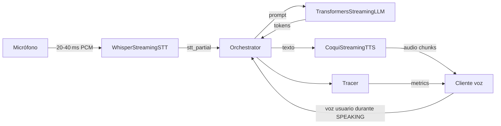

# 🧠 Sanctuary – Pipeline de Voz Full Duplex

Sanctuary ahora incluye una orquestación **E2E en streaming** que escucha, razona y responde sobre la marcha. El ciclo completo admite:

- **STT** con parciales cada ~150 ms, final con heurística de endpointing y *token timings* cuando el backend los soporta.
- **LLM** con `generate_stream()` token a token.
- **TTS** que reproduce audio en chunks (100–200 ms) con `stop()` inmediato para *barge-in*.
- **Tracer** que expone latencias (`stt_first_partial_ms`, `llm_first_token_ms`, …) en formato JSON.
- **Cliente de micrófono** que envía audio 16 kHz en vivo y reproduce la respuesta del asistente.

---

## 🔁 Flujo de extremo a extremo



El objetivo es entregar las primeras palabras del asistente en **< 800 ms** y turnos completos < 1.2 s.

---

## 🚀 Puesta en marcha

1. **Preparar entorno**

   ```bash
   python -m venv .venv
   source .venv/bin/activate
   pip install -r requirements.txt
   ```

   > Requisitos adicionales: `ffmpeg` para Whisper y dependencias del modelo Coqui XTTS (la primera ejecución descargará los pesos).

2. **Configurar modelos (opcional)**

   Variables de entorno disponibles:

   | Variable | Descripción | Default |
   | --- | --- | --- |
   | `SANCTUARY_STT_MODEL` | Tamaño del modelo Whisper (`tiny`, `base`, `small`, …) | `small` |
   | `SANCTUARY_STT_LANGUAGE` | ISO 639-1 para forzar idioma | `es` |
   | `SANCTUARY_LLM_MODEL` | HuggingFace model id (causal LM) | `distilgpt2` |
   | `SANCTUARY_LLM_SYSTEM_PREFIX` | Prefijo de estilo para el prompt | `""` |
   | `SANCTUARY_TTS_MODEL` | Modelo Coqui TTS | `tts_models/multilingual/multi-dataset/xtts_v2` |
   | `SANCTUARY_TTS_LANGUAGE` | Idioma de síntesis | `es` |
   | `SANCTUARY_TTS_SPEAKER_WAV` | Ruta a audio para *voice cloning* | `None` |

3. **Levantar el servidor WebSocket**

   ```bash
    uvicorn main:app --host 0.0.0.0 --port 8000 --reload
   ```

4. **Conectar el cliente de micrófono**

   ```bash
   python voice_client.py --print-events
   ```

   El cliente captura audio mono 16 kHz en bloques de 20 ms, imprime parciales STT / métricas y reproduce los chunks de TTS que envía el servidor.

---

## 🌐 Protocolo `/voice`

- **Cliente → Servidor (binario):** PCM `int16` mono 16 kHz, bloques de 20–40 ms.
- **Servidor → Cliente:**

  ```json
  {"type": "tts_metadata", "sample_rate": 24000}
  {"type": "stt_partial", "text": "hola es", "is_final": false}
  {"type": "stt_final", "text": "hola, ¿estás ahí?", "is_final": true}
  {"type": "assistant_text", "text": "¡Hola! Sí, te escucho."}
  {"type": "metrics", "stt_first_partial_ms": 180, "llm_first_token_ms": 220, "tts_first_audio_ms": 140, "turn_total_ms": 980}
  ```

- **Audio TTS:** frames binarios PCM (`int16`) enviados como mensajes WS binarios. El cliente reajusta automáticamente la frecuencia usando `tts_metadata`.
- **Fin de turno opcional:** `{"type": "end_user_turn"}`.

---

## 🧩 Componentes relevantes

- `Services/sanctuary_core/interfaces.py` – contratos de STT/LLM/TTS/VAD.
- `Services/sanctuary_core/orchestrator.py` – estados `LISTENING → THINKING → SPEAKING`, barge-in y colas de audio.
- `Services/sanctuary_core/tracer.py` – utilidades `mark()` y `span()` + cálculo de métricas.
- `Services/sanctuary_core/llm_transformers.py` – adaptador HuggingFace con `TextIteratorStreamer`.
- `Services/sanctuary_stt/whisper_streaming.py` – Whisper en streaming con parciales y finales.
- `Services/sanctuary_tts/coqui_streaming.py` – síntesis XTTS v2 troceada para streaming.
- `voice_client.py` – CLI que envía audio del micrófono y reproduce la respuesta.

---

## 📊 Telemetría

El orquestador utiliza `Tracer` para registrar eventos con `time.perf_counter()` y, al cerrar el turno, envía `{"type": "metrics", …}` al cliente. También imprime en stdout un arreglo JSON con el timeline completo, útil para dashboards o exportar a observabilidad.

---

## 🧪 Pruebas automáticas

La suite cubre escenarios de parciales STT, arranque temprano de TTS, *barge-in* y emisión de métricas.

```bash
pytest
```

---

## 🛣️ Próximos pasos sugeridos

- Añadir *jitter buffer* configurable en el cliente (actualmente usa reproducción directa).
- Integrar almacenamiento de contexto conversacional y memoria a largo plazo.
- Instrumentar OpenTelemetry y dashboards de latencia por etapa.
- Añadir fallback de modelos ligeros para hardware sin GPU.

---

## 📄 Licencia

Proyecto licenciado bajo Apache 2.0. Consulta `LICENSE` para más detalles.
